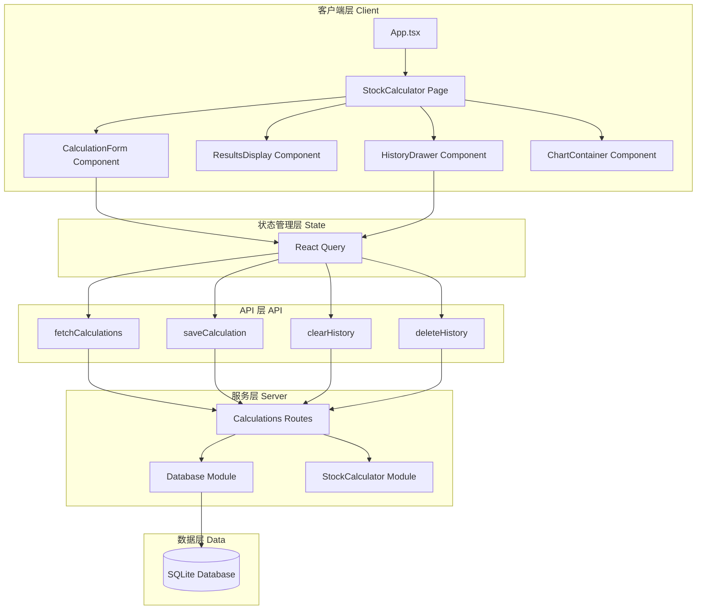
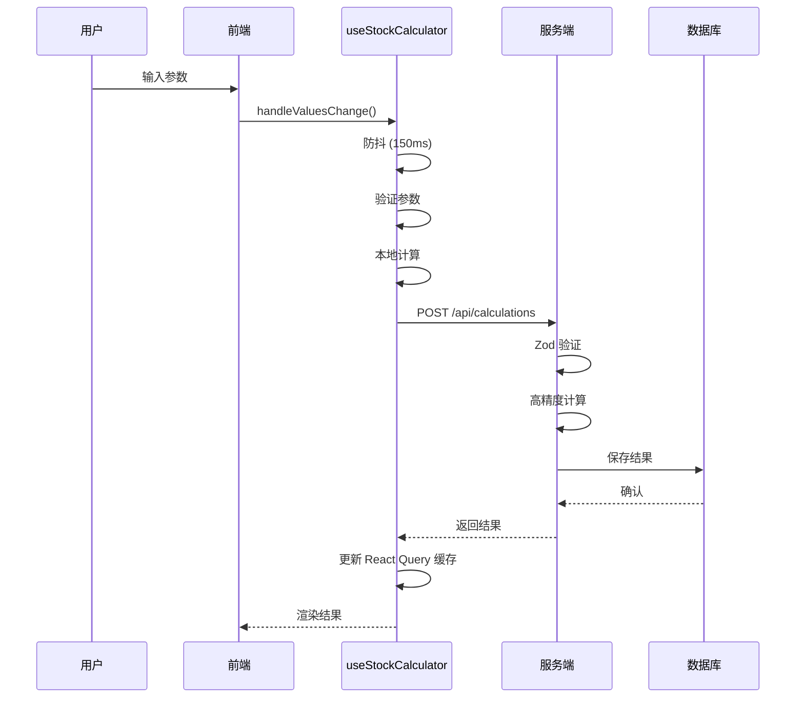
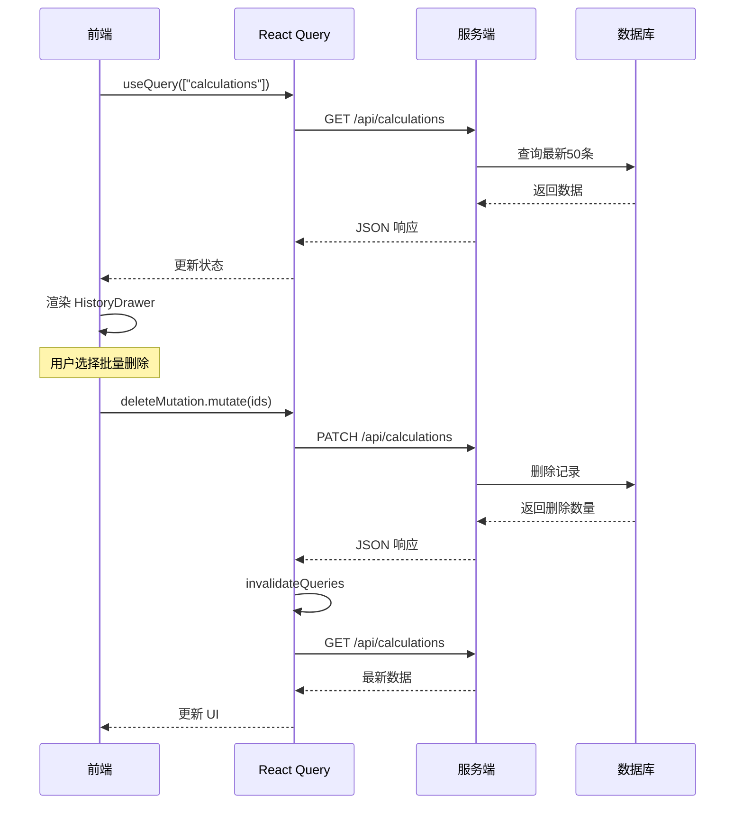

# 项目架构文档

## 系统概述

股票连板计算器是一个前后端分离的单页应用，采用现代化技术栈构建。

- **前端**：React 19 + Ant Design 6 + Tailwind CSS 4
- **后端**：Bun 服务器 + SQLite 数据库
- **通信**：RESTful API + React Query 数据同步

## 架构图



## 目录结构

```
src/
├── client/                    # React 前端代码
│   ├── components/            # UI 组件
│   │   ├── charts/            # 图表组件
│   │   │   ├── BasicChart.tsx
│   │   │   ├── ChartTypeSelector.tsx
│   │   │   └── ChartContainer.tsx
│   │   ├── displays/          # 展示组件
│   │   │   ├── ResultsDisplay.tsx
│   │   │   ├── ResultOverviewCard.tsx
│   │   │   └── HistoryDrawer.tsx
│   │   ├── forms/             # 表单组件
│   │   │   └── CalculationForm.tsx
│   │   └── shared/            # 共享组件
│   │       ├── ThemeToggle.tsx
│   │       └── ui/            # 基础 UI 组件
│   ├── hooks/                 # 自定义 Hooks
│   │   ├── useStockCalculator.ts
│   │   ├── useResponsive.ts
│   │   └── useResponsiveConfig.ts
│   ├── pages/                 # 页面组件
│   │   └── StockCalculator.tsx
│   ├── theme/                 # 主题配置
│   │   └── index.tsx
│   ├── App.tsx                # 根组件
│   ├── QueryProvider.tsx      # React Query 配置
│   ├── frontend.tsx           # 前端入口
│   └── index.css              # 全局样式
├── server/                    # Bun 后端代码
│   ├── __tests__/             # 测试文件
│   ├── database.ts            # 数据库操作
│   ├── calculations.ts        # API 路由
│   ├── stockCalculator.ts     # 计算逻辑
│   └── index.ts               # 服务器入口
└── shared/                    # 前后端共享
    ├── constants/             # 常量定义
    │   ├── index.ts
    │   └── colors.ts
    ├── config/                # 配置
    │   └── env.ts             # 环境变量
    ├── schemas/               # Zod 验证 Schema
    │   └── index.ts
    ├── types/                 # TypeScript 类型
    │   └── index.ts
    └── utils/                 # 工具函数
        ├── errorHandler.ts    # 错误处理
        ├── formatters.ts      # 格式化
        ├── logger.ts          # 日志
        └── validator.ts       # 验证
```

## 核心模块说明

### 1. 客户端

#### Components

- **CalculationForm**：参数输入表单，支持实时验证和防抖
- **ResultsDisplay**：计算结果展示，支持图表切换
- **BasicChart**：基础图表组件（柱状图/曲线图/双轴图）
- **HistoryDrawer**：历史记录抽屉，支持筛选和批量删除

#### Hooks

- **useStockCalculator**：
  - 管理计算状态
  - 处理 API 请求
  - 本地缓存计算结果
  - 自动防抖触发计算

### 2. 服务端

#### API Routes

- `GET /api/calculations`：获取历史记录
- `POST /api/calculations`：创建新计算
- `DELETE /api/calculations`：清除所有记录
- `PATCH /api/calculations`：批量删除

#### Database

使用 SQLite 存储，表结构：

```sql
CREATE TABLE calculations (
  id TEXT PRIMARY KEY,
  timestamp INTEGER NOT NULL,
  initial_price REAL NOT NULL,
  board_count INTEGER NOT NULL,
  daily_return REAL NOT NULL,
  final_price_up REAL NOT NULL,
  total_return_up REAL NOT NULL,
  total_gain_up REAL NOT NULL,
  details_up TEXT NOT NULL,
  daily_details_up TEXT NOT NULL,
  final_price_down REAL NOT NULL,
  total_return_down REAL NOT NULL,
  total_gain_down REAL NOT NULL,
  details_down TEXT NOT NULL,
  daily_details_down TEXT NOT NULL,
  UNIQUE(initial_price, board_count, daily_return)
);
```

#### Calculation Logic

- 使用 Decimal.js 高精度计算
- 支持双向计算（涨停 + 跌停）
- 边界条件验证
- 逐日数据追踪

### 3. 共享模块

#### Type Safety

- 前后端共享 TypeScript 类型定义
- Zod schema 运行时验证
- 类型推断：`type T = z.infer<typeof Schema>`

#### Error Handling

- 统一的 `AppError` 类型
- 错误工厂 `ErrorFactory`
- 未知错误包装 `ErrorHandler.handleUnknown()`
- 用户友好的错误消息

#### Logging

- 结构化日志（生产环境 JSON）
- 彩色日志（开发环境）
- 日志级别：debug, info, warn, error
- 上下文和错误堆栈支持

## 数据流

### 计算流程



### 历史记录流程



## 技术决策

### 为什么选择 Bun？

- **性能**：比 Node.js 快 3-4 倍
- **一体化**：内置 bundler、test runner、包管理器
- **兼容性**：完全兼容 Node.js 生态
- **开发体验**：快速启动、原生 HMR

### 为什么选择 React Query？

- **状态同步**：自动处理服务端状态
- **缓存策略**：智能缓存去重
- **乐观更新**：提升用户体验
- **类型安全**：完整的 TypeScript 支持

### 为什么选择 Decimal.js？

- **精度问题**：JavaScript 浮点数精度不足
- **金融计算**：价格和金额需要高精度
- **性能优秀**：比 BigNumber.js 更快
- **API 友好**：流畅链式调用

### 为什么使用 Zod？

- **类型安全**：运行时 + 编译时双重验证
- **推断类型**：自动生成 TypeScript 类型
- **错误友好**：详细的错误消息
- **轻量级**：零依赖，体积小

## 扩展性设计

### 添加新的计算类型

1. 在 `schemas/index.ts` 添加新的 Zod schema
2. 在 `stockCalculator.ts` 实现计算逻辑
3. 在 API 路由添加新的端点
4. 在前端添加对应的 UI 组件

### 添加新的数据存储

1. 创建 Repository 类（如 `MongoDBRepository`）
2. 实现 `getCalculations` 等接口
3. 更新 `server/database.ts` 依赖注入
4. 所有现有代码无需修改

### 添加新的 API 端点

1. 在对应路由文件添加方法
2. 使用 `apiResponse.success()` 或 `apiResponse.error()`
3. 使用 Zod 验证输入
4. 统一错误处理

## 性能优化

### 前端优化

- React.memo 包裹列表项组件
- 防抖用户输入（150ms）
- React Query 缓存去重
- 懒加载历史记录（最多 50 条）
- 代码分割（React.lazy，如需要）

### 后端优化

- SQLite 索引（timestamp）
- 参数化查询防注入
- 高精度计算优化
- 异步数据库操作
- 统一错误响应

## 安全性

### 输入验证

- 所有 API 输入使用 Zod schema 验证
- 类型安全的数据转换
- 边界条件检查

### 错误处理

- 不暴露敏感信息（生产环境）
- 结构化错误日志
- 统一的错误响应格式

### 数据安全

- SQL 注入防护（参数化查询）
- XSS 防护（React 默认清理）
- 数据库文件权限保护

## 监控和日志

### 日志系统

- 分级日志（debug, info, warn, error）
- 结构化输出（生产 JSON）
- 彩色输出（开发）
- 上下文和错误堆栈

### 未来扩展

- 添加 Prometheus 指标
- 集成 Sentry 错误追踪
- 添加 APM 监控
- 健康检查端点

## 部署架构

### 当前架构（单机）

```
[用户浏览器] -> [Bun Server (3000)] -> [SQLite DB]
```

### 推荐架构（生产）

```
[用户] -> [CDN] -> [负载均衡] -> [Bun 实例 x N]
                                      |
                                   [PostgreSQL]
```

### 容器化部署

```dockerfile
FROM oven/bun:1.3.4
WORKDIR /app
COPY package.json bun.lockb ./
RUN bun install --production
COPY . .
RUN bun run build
EXPOSE 3000
CMD ["bun", "start"]
```

## 维护指南

### 代码质量检查

```bash
# Lint（类型感知）
bun run lint

# 格式化代码
bun run format

# 运行测试
bun test
```

### 数据库迁移

当前使用 SQLite，如需迁移到其他数据库：

1. 创建迁移脚本
2. 备份现有数据
3. 执行迁移
4. 测试验证

### 依赖更新

```bash
# 检查过期依赖
bun update

# 审核 Bun 安全公告
# https://bun.sh/blog
```

## 参考资料

- [Bun 官方文档](https://bun.sh)
- [React 文档](https://react.dev)
- [Ant Design 文档](https://ant.design)
- [Tailwind CSS 文档](https://tailwindcss.com)
- [React Query 文档](https://tanstack.com/query)
- [Zod 文档](https://zod.dev)
- [Recharts 文档](https://recharts.org)
